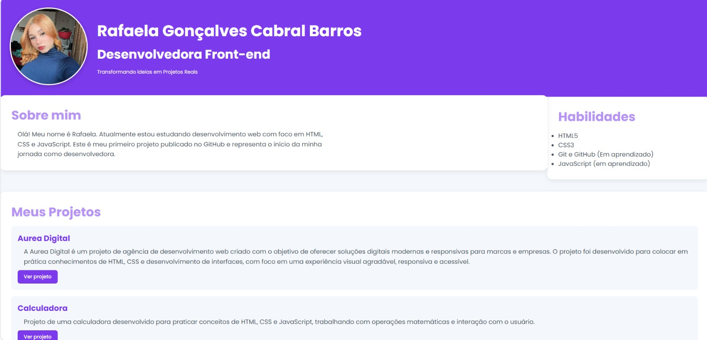
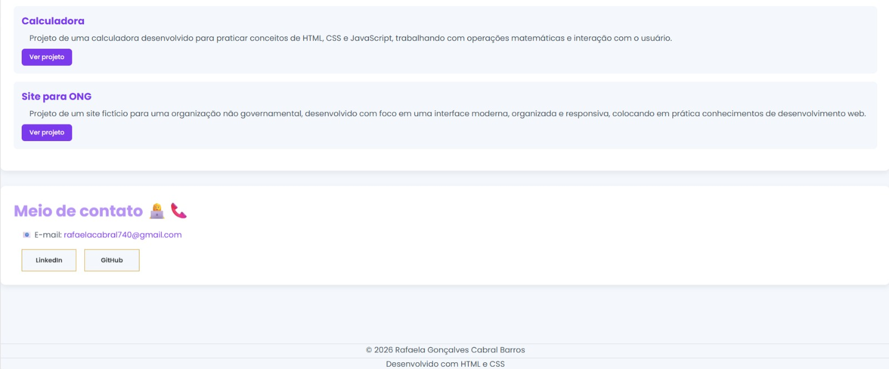

💜 Portfólio - Rafaela Cabral

Meu portfólio pessoal desenvolvido para apresentar minha trajetória,
habilidades e projetos na área de desenvolvimento Front-end.

🚀 Sobre o projeto

Este projeto foi desenvolvido como parte da minha jornada de aprendizado
em desenvolvimento web, utilizando principalmente HTML5 e CSS3.

O objetivo é apresentar minhas informações de forma simples, organizada,
responsiva e visualmente agradável.

🛠️ Tecnologias utilizadas

HTML5

CSS3

Google Fonts - Poppins

Git e GitHub

GitHub Pages

✨ Funcionalidades

Apresentação pessoal

Seção de habilidades

Lista de projetos

Links para visualizar os projetos

Links para LinkedIn e GitHub

Design responsivo para diferentes tamanhos de tela

Efeitos de hover nos botões e seções

## 🖥️ Prévia do projeto

### Início

### Meio/Fim

📂 Projetos apresentados

Aurea Digital

Projeto de uma agência de desenvolvimento web criado para praticar HTML,
CSS e desenvolvimento de interfaces.

🔗 Ver
projeto

Calculadora

Projeto desenvolvido para praticar HTML, CSS e JavaScript, trabalhando
com operações matemáticas e interação com o usuário.

🔗 Ver projeto

Site para ONG

Projeto de um site fictício para uma organização não governamental,
desenvolvido com foco em uma interface moderna, organizada e responsiva.

🔗 Ver
projeto

👩‍💻 Autora

Rafaela Gonçalves Cabral Barros

Desenvolvedora Front-end em formação.

💼 LinkedIn

🐙 GitHub

© 2026 Rafaela Gonçalves Cabral Barros# portfolio-pessoall
Meu primeiro portfólio desenvolvido com HTML e CSS.
